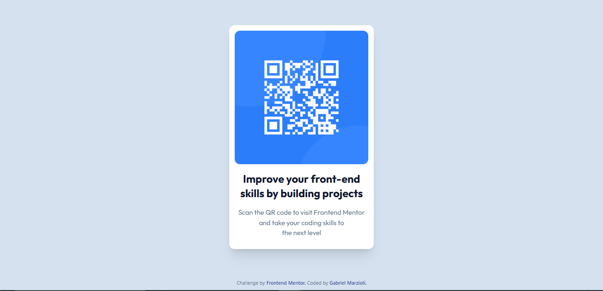
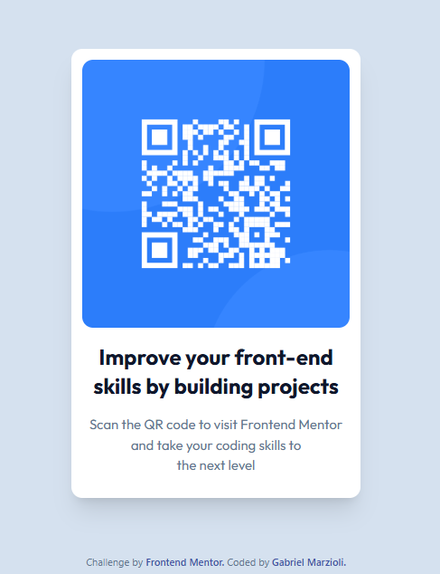

# Frontend Mentor - QR code component solution

This is a solution to the [QR code component challenge on Frontend Mentor](https://www.frontendmentor.io/challenges/qr-code-component-iux_sIO_H). Frontend Mentor challenges help you improve your coding skills by building realistic projects.

## Table of contents

- [Frontend Mentor - QR code component solution](#frontend-mentor---qr-code-component-solution)
  - [Table of contents](#table-of-contents)
  - [Overview](#overview)
    - [Screenshots](#screenshots)
  - [Version Desktop](#version-desktop)
  - [Version Mobile](#version-mobile)
    - [Links](#links)
  - [My process](#my-process)
    - [Built with](#built-with)
    - [What I learned](#what-i-learned)
    - [Continued development](#continued-development)
    - [Useful resources](#useful-resources)
  - [Author](#author)

## Overview

### Screenshots

## Version Desktop



## Version Mobile



### Links

- Solution URL: [Add solution URL here](https://github.com/gabriel073/git-test/)
- Live Site URL: [Add live site URL here](https://frontendmentor-qrapp.netlify.app/)

## My process

### Built with

- Semantic HTML5 markup
- CSS custom properties - with tailwind UI
- Flexbox - with tailwind UI
- Mobile-first workflow
- [React](https://reactjs.org/) - JS library
- [Tailwind UI](https://tailwindcss.com/) - For styles

### What I learned

This experience helped me strengthen and practice more with flexbox and tailwindUI, and build the entire structure from scratch with react Js, Tailwind UI. It was a lot of fun doing everything manually, so to speak.

Here's an example of how it simplifies everything in a React component:

```Component React
function CardQr() {
    return (
        <main className="flex flex-col w-[20rem] h-[31rem] bg-white p-3 rounded-xl  shadow-xl" >
            
            <div className='flex flex-col'>
                <h1 className='text-2xl text-center font-[Outfit] font-bold text-slate-900 mb-4'>Improve your front-end skills by building projects</h1>
                <p className='text-center font-[Outfit] text-[15px] font-normal text-slate-500 mb-6'>Scan the QR code to visit Frontend Mentor and take your coding skills to <br/>the next level
                </p>
            </div>
        </main>
    )
}
export default CardQr;
```

### Continued development

I'd like to continue laying out components and developing user interactions, different actions, and events as required by the project using new technologies, for example, Next Js.

### Useful resources

- [Example resource 1](https://tailwindcss.com/) - With Tailwind UI, I can easily integrate modern CSS into the same component, allowing me to move faster in the process.
- [Example resource 2](https://react.dev/) - With React Js, I created a simple component that can be reused and modularized as the project grows in the future.

## Author

- Website - [Gabriel Marzioli](https://portfolio-fullstack-pi.vercel.app/)
- Frontend Mentor - [@gabriel073](https://www.frontendmentor.io/profile/gabriel073)
- Twitter - [@GabyDev73](https://x.com/GabyDev73)
- Linkedin - [Gabriel Marzioli](https://www.linkedin.com/in/gabriel-marzioli/)
